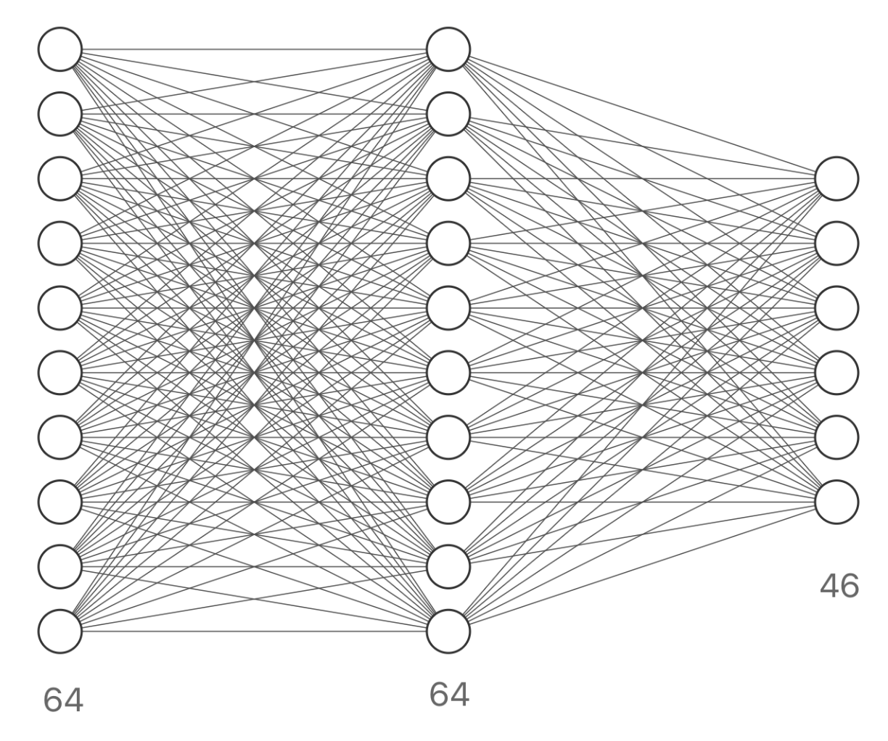

# REUTERS
这次我们要解决的问题，比 02_IMDB 要复杂一点。之前的问题是判断电影评论是正面还是负面。这次我们要根据一段新闻内容判断新闻的分类。这是一个**多分类**问题。因为我们使用的数据集，新闻的分类有 46 种。

我们使用的数据集是路透社的新闻数据。一共包括 46 个新闻分类，每一个新闻分类下至少有 10 个样本。我们一共有 8982 个训练数据和 2246 个测试数据。


# 1、数据集
首先加载数据集


```python
from keras.datasets import reuters

(train_data, train_labels), (test_data, test_labels)=reuters.load_data(num_words=10000)
```

    2023-06-03 21:17:36.955998: I tensorflow/core/platform/cpu_feature_guard.cc:193] This TensorFlow binary is optimized with oneAPI Deep Neural Network Library (oneDNN) to use the following CPU instructions in performance-critical operations:  AVX2 FMA
    To enable them in other operations, rebuild TensorFlow with the appropriate compiler flags.


与IMDB数据集一样，参数num_words=10000将数据限定为前10000个最常出现的单词。每个样本都是一个整数列表（表示单词索引）。


```python
print(train_data[6])
```

    [1, 56, 5539, 925, 149, 8, 16, 23, 931, 3875, 25, 116, 5, 165, 15, 10, 67, 13, 12, 12, 11, 5311, 400, 81, 79, 457, 145, 22, 331, 28, 3026, 331, 61, 3609, 2097, 5311, 79, 64, 85, 1863, 84, 22, 44, 6206, 2275, 79, 296, 1384, 157, 5539, 8, 16, 23, 3875, 4, 116, 6, 837, 5311, 6, 3834, 31, 248, 1032, 8757, 4, 1618, 5, 37, 38, 1639, 27, 358, 37, 38, 4716, 9, 6, 9474, 4, 316, 9, 662, 5, 4, 765, 5, 291, 58, 60, 2660, 1067, 136, 4, 384, 292, 270, 120, 17, 12]


同样，使用下面的代码可以解码新闻内容。


```python
word_index = reuters.get_word_index()
# 反转索引，work_index 的 key 是单词，value 是索引，反转后，key 是索引，value 是单词
reverse_word_index = dict([(value,key) for (key,value) in word_index.items()])
decodede_review = ' '.join(reverse_word_index.get(i-3,'?') for i in train_data[3])
print(decodede_review)
```

    ? the farmers home administration the u s agriculture department's farm lending arm could lose about seven billion dlrs in outstanding principal on its severely ? borrowers or about one fourth of its farm loan portfolio the general accounting office gao said in remarks prepared for delivery to the senate agriculture committee brian crowley senior associate director of gao also said that a preliminary analysis of proposed changes in ? financial eligibility standards indicated as many as one half of ? borrowers who received new loans from the agency in 1986 would be ? under the proposed system the agency has proposed evaluating ? credit using a variety of financial ratios instead of relying solely on ? ability senate agriculture committee chairman patrick leahy d vt ? the proposed eligibility changes telling ? administrator ? clark at a hearing that they would mark a dramatic shift in the agency's purpose away from being farmers' lender of last resort toward becoming a big city bank but clark defended the new regulations saying the agency had a responsibility to ? its 70 billion dlr loan portfolio in a ? yet ? manner crowley of gao ? ? arm said the proposed credit ? system attempted to ensure that ? would make loans only to borrowers who had a reasonable change of repaying their debt reuter 3


# 2、数据处理
与 02_IMDB 一样需要把数据向量化，需要将一条新闻转换成为一个长度为 10000 的数组。用 0 和 1 表示新闻里是否出现过该单词。下标与单词表的下标一致。


```python
import numpy as np

def vectorize_sequences(sequences,dimension = 10000):
    # 入参是一个元组
    results = np.zeros((len(sequences),dimension))
    for i,sequence in enumerate(sequences):
        results[i,sequence] = 1
    return results

x_train = vectorize_sequences(train_data)
x_test = vectorize_sequences(test_data)
```

因为这次一共有 46 个分类，所以我们也需要对标签数据处理下。我们使用一个长度为 46 的数组来表示其中的一个分类，这个数组只有一个分类对应的下标元素为 1 ，其他的都是 0。还记得 01_MNIST 的标签编码么？都是一种方式。这种常见的方式叫 **one-hot编码**。下面我们对这 46 中分类进行 one-hot编码。


```python
from tensorflow.keras.utils import to_categorical

one_hot_train_labels = to_categorical(train_labels)
one_hot_test_labels = to_categorical(test_labels)

print(test_labels[0])
print(one_hot_test_labels[0])
```

    3
    [0. 0. 0. 1. 0. 0. 0. 0. 0. 0. 0. 0. 0. 0. 0. 0. 0. 0. 0. 0. 0. 0. 0. 0.
     0. 0. 0. 0. 0. 0. 0. 0. 0. 0. 0. 0. 0. 0. 0. 0. 0. 0. 0. 0. 0. 0.]


# 3、构建神经网络
我们将构建一个三层的神经网络，其中前两层有 64 个单元，最后一层有 46 个单元，对应 46 种分类，需要注意的是。因为一共有 46 个分类，所以如果前两层的单元数小于 46 就会造成信息瓶颈。无法学会区分 46 种分类。最后一层我们依然使用 softmax 函数。




```python
from keras import models
from keras import layers

model = models.Sequential()
model.add(layers.Dense(64,activation='relu',input_shape = (10000,)))
model.add(layers.Dense(64,activation='relu'))
model.add(layers.Dense(46,activation='softmax'))
```

    2023-06-03 21:17:44.914453: I tensorflow/core/platform/cpu_feature_guard.cc:193] This TensorFlow binary is optimized with oneAPI Deep Neural Network Library (oneDNN) to use the following CPU instructions in performance-critical operations:  AVX2 FMA
    To enable them in other operations, rebuild TensorFlow with the appropriate compiler flags.


# 4、编译神经网络
我们使用 **categorical_crossentropy（分类交叉熵）** 作为损失函数，它用于衡量两个概率分布之间的距离，这里两个概率分布分别是网络输出的概率分布和标签的真实分布。


```python
model.compile(optimizer='rmsprop',loss='categorical_crossentropy',metrics=['accuracy'])
```

# 5、训练模型
我们预留一部分训练数据作为验证数据。


```python
x_val = x_train[0:1000]
partial_x_train = x_train[1000:]
ßßßß
y_val = one_hot_train_labels[0:1000]
partial_y_train = one_hot_train_labels[1000:]

```

训练 10 个轮次，每次 512 个批次。


```python
history = model.fit(partial_x_train,partial_y_train,epochs=8,batch_size=512,validation_data=(x_val,y_val))
model.evaluate(x_test,one_hot_test_labels)
```

    Epoch 1/8
    16/16 [==============================] - 1s 25ms/step - loss: 2.6197 - accuracy: 0.5256 - val_loss: 1.6998 - val_accuracy: 0.6440
    Epoch 2/8
    16/16 [==============================] - 0s 17ms/step - loss: 1.4076 - accuracy: 0.7126 - val_loss: 1.2711 - val_accuracy: 0.7120
    Epoch 3/8
    16/16 [==============================] - 0s 18ms/step - loss: 1.0285 - accuracy: 0.7850 - val_loss: 1.1107 - val_accuracy: 0.7660
    Epoch 4/8
    16/16 [==============================] - 0s 17ms/step - loss: 0.8039 - accuracy: 0.8354 - val_loss: 1.0131 - val_accuracy: 0.7910
    Epoch 5/8
    16/16 [==============================] - 0s 18ms/step - loss: 0.6347 - accuracy: 0.8707 - val_loss: 0.9486 - val_accuracy: 0.8000
    Epoch 6/8
    16/16 [==============================] - 0s 17ms/step - loss: 0.5049 - accuracy: 0.8960 - val_loss: 0.9197 - val_accuracy: 0.8120
    Epoch 7/8
    16/16 [==============================] - 0s 17ms/step - loss: 0.4071 - accuracy: 0.9162 - val_loss: 0.9000 - val_accuracy: 0.8120
    Epoch 8/8
    16/16 [==============================] - 0s 15ms/step - loss: 0.3319 - accuracy: 0.9293 - val_loss: 0.9642 - val_accuracy: 0.7950
    71/71 [==============================] - 0s 1ms/step - loss: 1.0204 - accuracy: 0.7654


    [1.0204036235809326, 0.7653606534004211]


最终在测试集上，我本地得到了 79% 的准确率。比起完全随机的分类器，效果还是非常不错的。

# 6、神经网络内部到底在做什么
下面我们从数据视角看下神经网络内部到底在做什么。

## 6.1、输入层和隐藏层
输入层和隐藏层的计算逻辑跟之前的 02_IMDB 基本一致。将一个长度为 10000 的数组输入到这一层的每一个神经单元。然后通过这一层的权重值计算后使用 relu 函数计算神经单元的输出。这里不在赘述。

## 6.2 输出层
与 02_IMDB 不同的是，输出层使用的是 softmax 激活函数，因为这是一个多分类问题。

## 6.3 损失函数
关于 ```categorical_crossentropy``` 损失函数在 01_IMDB 里已经说的很清楚了，这里不再赘述。

# 7、总结

神经网络的层：
+ Dense（密集连接层）：可以用来处数值类的数据

激活函数：
+ relu： 一般配合 Dense 使用
+ softmax：用于处理多分类问题，最终输出每个分类的概率
+ sigmoid：用于处理二分类问题，最终输出 0 到 1 之间的概率值

损失函数：
+ categorical_crossentropy：用于多分类问题
+ binary_crossentropy：用于二分类问题

优化器：
+ rmsprop

经验：
+ 设置神经单元的数量时，一定要超过分类的个数，不然会出现信息瓶颈，在这一层之后的层都无法充分的学习如何区分品类。
